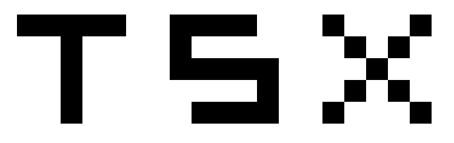
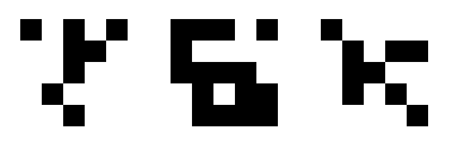

# simple-hopfield-network
An implementation of a discrete Hopfield network for bipolar pattern association.
The example is built to  memorize three Patterns: X,T and S.
The created network created from the three input patterns is capable of matching noised patterns to the patterns stored in its memory.

## The Example Network
A pattern is encoded with a -1 for a white pixel and a 1 for a black pixel.
The example network is built to work with the following three 5x5 patterns,
which are encoded as vectors of size 25:

With the same representation, modified versions of the original patterns have been created by adding some noise.
The goal is for the network to correctly map the modified versions to the corresponding original pattern.

## Capabilities and Problems
The example network is capable of correctly associating noised/modified versions of memorized patterns to the corresponding patterns.
Problems arise when a noised pattern is similar to more than one memorized patterns and might be associated with either of them,
depending on the seed used for the random number generator.
